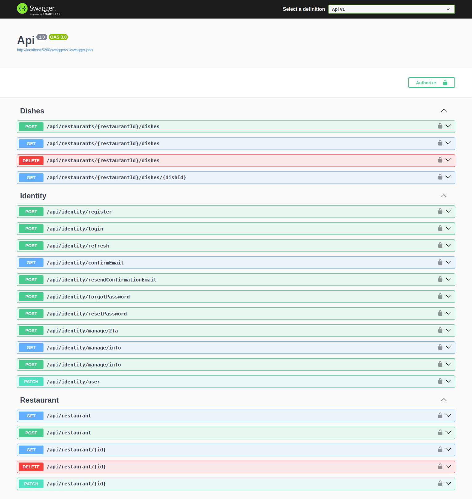

# Dodish

**Dodish** is a restaurant management application that allows users to create and manage restaurants and their dishes. The application also includes authentication and authorization capabilities using Identity.

## Features

- Restaurant and Dish Management
  - Add, edit, and delete restaurants and their dishes.
  - Query and paginate through data.
- Authentication and Authorization
  - User registration and login using ASP.NET Core Identity.
  - Role-based access control (e.g., Admin, User).
- Clean Architecture
  - Separation of concerns into layers: Api, Application, Domain, and Infrastructure.
- CQRS (Command Query Responsibility Segregation)
  - Organizes application logic into commands and queries.
- SQLite Database
  - Lightweight, file-based database for persistence.

## Project Structure

```plaintext
Dodish/
├── Api/                  # Handles API endpoints and middleware
├── Application/          # Contains business logic (CQRS, DTOs, etc.)
├── Domain/               # Defines entities, constants, and interfaces
├── Infrastructure/       # Handles database, migrations, and repositories
└── Dodish.sln            # Solution file
```

### Technologies Used

```markdown
## Technologies Used

- **ASP.NET Core** for API development
- **Entity Framework Core** for database management
- **Swagger** for API documentation
- **SQLite** as the database
- **CQRS** pattern for application logic
```

## Getting Started

### Prerequisites

- .NET SDK installed ([Download here](https://dotnet.microsoft.com/download))

### Setup

1. Clone the repository:

   ```bash
   git clone https://github.com/yourusername/dodish.git
   cd dodish
   ```

2. Install the project dependencies:

   ```bash
   dotnet restore
   ```

3. Build the project:

   ```bash
   dotnet build
   ```

4. Run the application:

   ```bash
   dotnet run
   ```

## API Endpoints



### Authentication (Identity)

- `POST /api/identity/register` - Register a new user
- `POST /api/identity/login` - Authenticate a user

### Restaurants

- `GET /api/restaurants` - Retrieve a paginated list of all restaurants
- `GET /api/restaurants/{id}` - Get details of a specific restaurant
- `POST /api/restaurants` - Add a new restaurant
- `PUT /api/restaurants/{id}` - Update an existing restaurant
- `DELETE /api/restaurants/{id}` - Delete a restaurant

### Dishes

- `GET /api/restaurants/{restaurantId}/dishes` - List all dishes of a specific restaurant
- `GET /api/restaurants/{restaurantId}/dishes/{dishId}` - Get details of a specific dish in a restaurant
- `POST /api/restaurants/{restaurantId}/dishes` - Add a new dish to a restaurant
- `PUT /api/restaurants/{restaurantId}/dishes/{dishId}` - Update a dish in a restaurant
- `DELETE /api/restaurants/{restaurantId}/dishes/{dishId}` - Remove a dish from a restaurant
